# Kura

**Kura** is the mobile (iOS) client and call-trigger layer for the
**VERA-cloud / AI-SoNar** post-discharge stroke follow-up system.

It lets a **provider trigger a voice check-in from a web console**, which then
**rings inside the open iPhone app**. Foreground polling is the current default;
locked-screen/closed-app delivery is not enabled. When the patient accepts, the app runs
the *existing* VERA-cloud voice check-in (Azure speech + dialog + BE-FAST
flagging) over VERA-cloud's existing audio WebSocket. Kura adds **no clinical
logic** — all assessment and escalation stays in the draft, not clinically validated,
VERA-cloud repo.

> Companion to [`vafaei-ar/VERA-cloud`](https://github.com/vafaei-ar/VERA-cloud).
> See [`docs/ARCHITECTURE.md`](docs/ARCHITECTURE.md) for the full design.



*Teal = reused from VERA-cloud · coral = new for the iOS beta.*

## What's here

```
Kura/
├── push-service/    Backend trigger service (FastAPI, Python)
│                    • registers patient devices (user_id → push token)
│                    • provider "start check-in" endpoint
│                    • creates a VERA-cloud session, sends the push
├── ios/             SwiftUI iOS app (the patient's phone)
│                    • registers for push, joins a check-in when triggered
│                    • streams audio to VERA-cloud's /ws/audio endpoint
└── docs/            Architecture & design notes
```

## Status

The session 1/2 feedback implementation is on `feat/session-feedback-pipeline`.
Start with [the engineering handoff](docs/FEEDBACK_IMPLEMENTATION.md) for current
behavior, paired configuration, verification, and remaining pilot gates. The older
scaffold/architecture descriptions below are historical context, not release readiness.

Early scaffold for a **TestFlight beta** of the trial. The `push-service`
runs and is testable today (with a dry-run push mode that needs no Apple
certificates). The `ios/` app is a skeleton with clear `TODO` markers where
your Apple bundle ID / team ID and audio plumbing go — build it in Xcode on a
Mac (see [`ios/README.md`](ios/README.md)).

## Quick start (backend)

```bash
cd push-service
python -m venv .venv && source .venv/bin/activate
pip install -r requirements.txt
cp .env.example .env          # dry-run mode works out of the box
uvicorn app.main:app --reload
# in another shell:
pytest
```

## Design decisions (see docs for rationale)

- **Foreground polling and a bounded in-app ring** are the current delivery mode.
  The home screen offers Test ring, an on/off setting, and Silence. Apple push
  setup and CallKit are separate future work, not enabled by this feature.
- **Reuse VERA-cloud `/ws/audio`** for the voice media — no new realtime infra.
- **No clinical logic in Kura** — VERA-cloud stays the single source of truth.

## Safety & scope

Inherits VERA-cloud's scope: a **bounded, non-diagnostic, human-supervised**
check-in tool. Kura only *transports* and *triggers*; it never diagnoses,
advises, or changes the clinical flow. No real patient data lives in this repo.


## License

This repository is currently **source-available for research transparency**. No open-source license has been assigned to Kura. Publication of the source code does not by itself grant reuse or redistribution rights. The clinical/dialog engine remains in the companion VERA-cloud repository, which carries its own license.
