# Kura — Architecture & Design Notes

Kura adds an **iPhone client** and a **provider-triggered call layer** to the
existing **VERA-cloud / AI-SoNar** post-discharge stroke follow-up system.
A provider starts a check-in from a web console; the patient's phone is
notified; on accept, the phone runs VERA-cloud's existing voice check-in.

Kura contains **no clinical logic**. All assessment, BE-FAST flagging, and
escalation stay in the clinically-reviewed VERA-cloud repo (which is "DRAFT,
pending clinician sign-off"). Kura only **triggers** and **transports**.



*Teal = reused from VERA-cloud, coral = new for the iOS beta.*

## Flow

```
Provider Console ──POST {user_id}──▶ Kura push-service
                                       │ 1. look up device by user_id
                                       │ 2. VERA /session/start ──▶ session_id
                                       │ 3. APNs push {session_id}
                                       ▼
                                  Apple APNs ──▶ iPhone app (notification)
                                       │ user taps "Start check-in"
                                       ▼
       iPhone  ◀──── wss://vera/ws/audio/{session_id} ────▶  VERA-cloud
                     (mic ↔ Azure STT/TTS + dialog + flagging → care team)
```

## New vs. reused

| Piece | Status | Where |
|---|---|---|
| Session creation (`/session/start`) | **Reuse** | VERA-cloud |
| Voice media (`/ws/audio/{session_id}`) | **Reuse** | VERA-cloud |
| Azure STT/TTS, dialog, BE-FAST flagging, escalation | **Reuse** | VERA-cloud |
| Device registration (`user_id → push token`) | **New** | `push-service` |
| Provider "start check-in" endpoint | **New** | `push-service` |
| APNs push sender | **New** | `push-service` |
| iOS app (register, notify, join session) | **New** | `ios/` |
| Provider web console | **New (TODO)** | not yet built — see below |

## Key decisions

**1. Plain notification, not CallKit (for the first beta).**
A normal "time for your check-in" notification is simpler to ship (no VoIP
entitlements, less App Review scrutiny) and is a gentler framing than an urgent
phone ring for a non-emergency, supervised check-in with stroke survivors — a
framing choice worth confirming with the IRB / clinical lead. The push payload
and join logic are isolated so a later **CallKit/PushKit** upgrade is a small,
contained change (see `ios/README.md` → "Upgrade path to CallKit").

**2. Reuse VERA-cloud `/ws/audio`, no new realtime infra.**
The phone is just a third client of the same audio WebSocket already used by the
web frontend and Telegram bot. Revisit a managed stack (Twilio/LiveKit) only if
real-device testing shows the raw WebSocket struggles on cellular.

**3. Kura is a separate service/repo, VERA-cloud untouched.**
Keeps the clinically-reviewed engine stable; Kura calls it over the network.

## Components

### push-service (FastAPI, Python) — `push-service/`
- `POST /v1/devices/register` — app stores `user_id → push_token`.
- `POST /v1/checkins/start` — provider triggers; creates a VERA session and pushes.
- `GET /health`, `GET /v1/devices/{user_id}` (debug, token masked).
- **DRY_RUN** mode logs pushes instead of sending → runs offline, no Apple certs.
- Device registry is in-memory/JSON; **swap for a real DB before production**.

### ios (SwiftUI) — `ios/`
- Registers for push, sends token to push-service.
- Parses `session_id` from the check-in invite, opens `/ws/audio/{session_id}`.
- `AudioSocketClient` implements **VERA's actual `/ws/audio` protocol**
  (from `api/main.py` + `frontend/static/app.js`):
  - **server → app** JSON: `greeting`/`audio`/`response`/`question`/`completion`
    with `text`, optional `audio_data` (base64 MP3), and `progress`.
  - **app → server** JSON: `{"type":"text_input","text": ...}`.
  - Recognition is **on-device** (`SFSpeechRecognizer`); bot speech plays the
    base64 MP3, or falls back to on-device TTS when `audio_data` is absent
    (so the loop works against the mock with no Azure).
  - Turn-taking: never listens while the bot speaks; a short silence ends the
    user's turn.

### Testing the audio loop without Azure
The push-service `/ws/audio/{session_id}` mock speaks VERA's protocol and runs a
scripted check-in (greeting → questions → completion). With the app pointed at
the push-service, you get a full spoken turn-loop (on-device TTS + recognition)
with no Azure/VERA. Point `Config.veraBaseURL` at real VERA-cloud to use Azure
voices and the real dialog/flagging engine.

## What's NOT built yet (next steps)

1. **Provider web console** — currently any HTTP client (curl/Postman) can call
   `/v1/checkins/start`. A minimal provider UI (patient list + "Start check-in")
   is the next backend-side piece. Could live in `push-service` or extend
   VERA-cloud's frontend.
2. **Real VERA `/session/start` contract** — confirm the exact request/response
   fields and wire `VERA_API_BASE`. Today the client stubs a UUID if unset.
3. **Audio protocol** — match `AudioSocketClient` to VERA's WS framing
   (sample rate, PCM vs. JSON control frames, who greets first).
4. **Persistence & auth** — real device DB; replace the single `PROVIDER_API_KEY`
   shared secret with provider identities/SSO.
5. **Consent & audit** — ensure the mobile path honors VERA-cloud's consent and
   append-only audit requirements.

## Hard constraints / things to know

- **iOS builds require a Mac + Xcode + Apple Developer account.** The app can't
  be compiled or signed in the backend sandbox. Push requires a **physical
  device** (not the Simulator).
- **Distribution:** TestFlight for the closed beta. Plain-notification apps clear
  review more easily than VoIP/CallKit ones.
- **APNs auth:** token-based (`.p8` auth key). Never commit the `.p8`,
  certificates, or provisioning profiles (see `.gitignore`).
- **Sandbox vs production APNs** must match the app's `aps-environment`
  entitlement (`development` for debug/TestFlight).
- **Regulatory:** Kura inherits VERA-cloud's non-diagnostic, human-supervised
  scope. Any change to how/when the patient is contacted is IRB-relevant.
```
